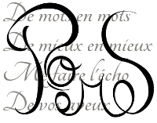

# Laure Bredelet

Pour la petite présentation, je suis fille et soeur d'informaticiens : j'ai toujours vu un ordinateur chez moi, et ça a toujours été mon mode de communication privilégié. J'ai fait mes premiers pas professionnels là-dedans mais j'ai bifurqué bien vite dans l'humain, j'avais besoin de me construire en dehors de la machine. Voilà qui est fait, je peux donc y revenir. ;)

## Expériences professionnelles

* **Programmeuse Visual Basic**... 8 mois en 2001 (pilotage de Word pour une simulation de crédit immobilier)

* **Formatrice Web**, bureautique, initiation informatique et Internet... 3 mois à la suite de mon expérience précédente

* **Aide-éducatrice** en école primaire, puis mère au foyer pendant 14 ans (3 enfants)

* **Bénévole** :
	* cours informatique dans les écoles primaires de mes enfants (préparation au B2i)
	* syndic de copropriété

* **Projet personnel** :

	* écriture d'un **livre historique** sur les fontaines de Paris avec une amie photographe

* **Stagiaire en communication** (2016)
	* mise en situation professionnelle chez *Alpha Distribution*, Entreprise d'Entraînement
	* préparation d'un stand jeu de l'oie pour la *foire expo de Bourges 2017* (présentation des 16 communes de l'agglomération)

* **Formatrice en communication et informatique commerciale** (vacataire) quelques heures par semaine (actuel)

## Formations

* Bac S

* Etudes à Sciences Po Toulouse (*je n'ai pas obtenu le diplôme*)

* Formation intensive "*Nouvelles Technologies*" début 2001 (3 mois)

* Début d'une formation inversée via le *CNAM* sur les acteurs et institutions de la formation (abandon)

## [Simplonline](http://simplonline.co) ?

La formation "Codeurs Web 18" organisée sur Bourges par [Egee](http://www.egee.asso.fr/) avec l'aide de la [BGE](http://bge.asso.fr/) me donne accès au MOOC [Game of Codes](https://www.codeursweb18.fr/)
> Un langage de programmation est censé être une façon conventionnelle de donner des instructions à un ordinateur, et doit pouvoir être écrit et relu par des personnes différentes. Il n’est pas censé être obscur, bizarre et plein de pièges subtils (ça, ce sont les attributs de la magie).

 `Dave Small, ST Magazine, novembre 1992`

* Dépoussiérer mes vieilles connaissances trop partielles (HTML, CSS, PHP, Javascript...)

* Me remettre dans le bain pour pouvoir aller plus loin par moi-même, dans l'environnement Web actuel qui permet tellement plus de choses

* Trouver un emploi - soit dans le pur développement, soit par combinaison de mes capacités en communication et en informatique.

## Premiers projets

* Faire de mon site ce que je veux ! Apparence, contenu, navigation.

	

* Faire le site Galerie d'une amie artiste

	
